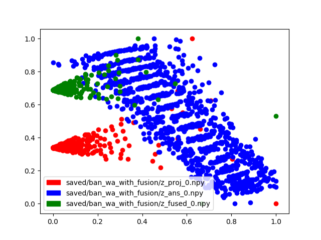
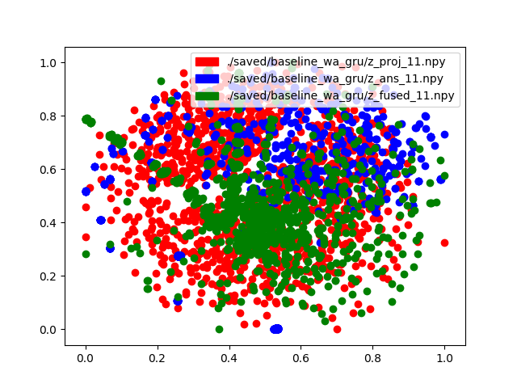
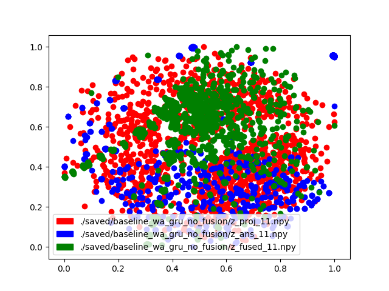

# ProjectX

<div>
	<a href="https://openvqa.readthedocs.io/en/latest/?badge=latest"></a>
</div>

## Visualisation:

Input -
1. Two npy files, each containing a numpy vector X (num_samples, feature_vector_dimension).

Output -
1. vis.png file



Example use - 
```
python vis.py -v baseline -e 10 -n 1000
```
This will use the files saved/baseline/z_proj_11.npy, saved/baseline/z_ans_11 and saved/baseline/z_fused_11 visualise the first 1000 examples from each.

Help - 
```
python3 vis.py -h
```

## Visualisations

- Baseline + gru + fusion (11th epoch)



- Baseline + gru without fusion (11th epoch) 


