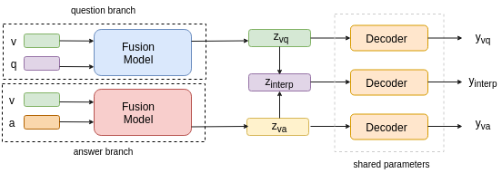

# Model-Agnostic Information Biasing for VQA



Architecture of the model. Only the question branch is used at the inference time.

## Environment Setup

Create a conda environment (or a python virtual environment) and install the required libraries and Glove word vectors.

```sh
conda create -n mib python=3.7
conda activate mib
pip install -r requirements.txt
wget https://github.com/explosion/spacy-models/releases/download/en_vectors_web_lg-2.1.0/en_vectors_web_lg-2.1.0.tar.gz -O en_vectors_web_lg-2.1.0.tar.gz
pip install en_vectors_web_lg-2.1.0.tar.gz
```

Install __Pytorch__ from the official website. This repository has been tested on __Pytorch>=1.3__.

## Data Setup

The experiments in this repository have been conducted on the established VQAv2 dataset. 

- __Image Features__:

We use pre-trained region-level (Bottom-Up) features, with each image being represented as a dynamic number (10 to 100) of 2048-dimensional features.

The features we use are provided by [OpenVQA](https://openvqa.readthedocs.io/en/latest/index.html) and can be downloaded from [Onedrive](https://awma1-my.sharepoint.com/:f:/g/personal/yuz_l0_tn/EsfBlbmK1QZFhCOFpr4c5HUBzUV0aH2h1McnPG1jWAxytQ?e=2BZl8O) and [BaiduYan](https://pan.baidu.com/s/1C7jIWgM3hFPv-YXJexItgw#list/path=%2F).

The downloaded files contains three files: __train2014.tar.gz__, __val2014.tar.gz__, and __test2015.tar.gz__, corresponding to the features of the train/val/test images for VQAv2, respectively.

All the image feature files are unzipped and placed in the __data/vqa/feats__ folder to form the following tree structure:

```
|-- data
	|-- vqa
	|  |-- feats
	|  |  |-- train2014
	|  |  |  |-- COCO_train2014_...jpg.npz
	|  |  |  |-- ...
	|  |  |-- val2014
	|  |  |  |-- COCO_val2014_...jpg.npz
	|  |  |  |-- ...
	|  |  |-- test2015
	|  |  |  |-- COCO_test2015_...jpg.npz
	|  |  |  |-- ...
```

- __QA Annotations__:

Download all the annotation json files for VQAv2, including the [train questions](https://s3.amazonaws.com/cvmlp/vqa/mscoco/vqa/v2_Questions_Train_mscoco.zip), [val questions](https://s3.amazonaws.com/cvmlp/vqa/mscoco/vqa/v2_Questions_Val_mscoco.zip), [test questions](https://s3.amazonaws.com/cvmlp/vqa/mscoco/vqa/v2_Questions_Test_mscoco.zip), [train answers](https://s3.amazonaws.com/cvmlp/vqa/mscoco/vqa/v2_Annotations_Train_mscoco.zip), and [val answers](https://s3.amazonaws.com/cvmlp/vqa/mscoco/vqa/v2_Annotations_Val_mscoco.zip).

All the QA annotation files are unzipped and placed in the data/vqa/raw folder to form the following tree structure:

```
|-- data
	|-- vqa
	|  |-- raw
	|  |  |-- v2_OpenEnded_mscoco_train2014_questions.json
	|  |  |-- v2_OpenEnded_mscoco_val2014_questions.json
	|  |  |-- v2_OpenEnded_mscoco_test2015_questions.json
	|  |  |-- v2_OpenEnded_mscoco_test-dev2015_questions.json
	|  |  |-- v2_mscoco_train2014_annotations.json
	|  |  |-- v2_mscoco_val2014_annotations.json
```

## Reproducing the Results

The following command can be used to train MFB on the VQAv2 dataset.

```sh
python run.py --RUN='train' --MODEL='mfb' --DATASET='vqa' --VERSION='mfb_sample_run'
```

Where ```VERSION``` is a string that describes your run.

The configuration of any run can be tweaked using the config files present in the ```configs/vqa``` directory. By default, the ```TRAINING_MODE``` is set to ```original```, which will train the original version of the model. Other options are described below:

Choices for ```TRAINING_MODE```:

1. __simultaneous_qa__: In this case, both the question and the answer branch will be trained simultaneously.
2. __pretraining_ans__: The answer branch will be trained. 
3. __pretrained_ans__: The pretrained weights will be used to initialize the answer branch.

In all the cases, checkpoints will be saved under the ```ckpts/``` directory.

To train the MFB model in ```pretrained_ans``` training mode, following command can be used after changing the ```configs/vqa/mfb.yml``` file to set the training mode.

```
python run.py --RUN='train' --MODEL='mfb' --DATASET='vqa' --VERSION='mfb_pretrained_ans' --CKPT_V='mfb_pretraining_ans' --CKPT_E='12'
```

This assumes that you have previously trained the answer branch for atleast 13 epochs and the version name for that run was ```mfb_pretraining_ans```.

The default configs should be sufficient to reproduce the results, however, you might want to tweak the configs in order to conduct more experiments.

## Visualizations


Visualizations such as the above can be plotted using the ```vis.sh``` script. Instruction for the same are included in the file itself.

## WANDB Support

This project supports ```wandb``` which is an awesome tool for visualization. You can create a project on wandb after logging in. Set the name of your project in the config file.
